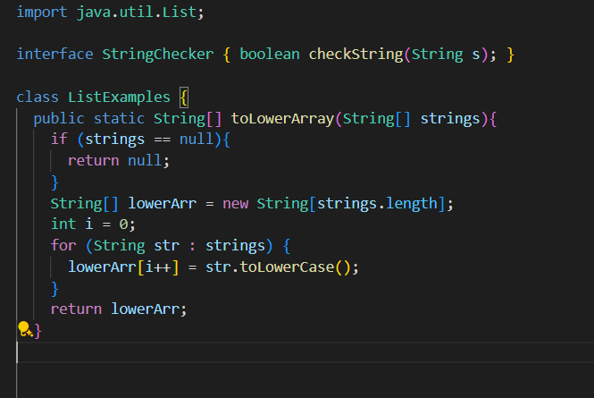
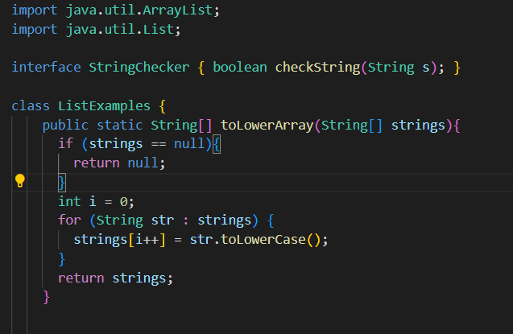
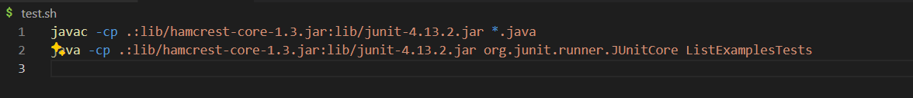

Lab Report 5 - Putting it all together

Part 1 - Debugging Scenario

Me: Hello, I actually am not able to figure out what is wrong with my code. It seems to not work for the tests that I am applying it on. I think there is a for loop problem but I am not sure. Below is my code where I have the issue.

TA: The mistake that you have in the given code was the part where you are calling `.toLowerCase` in the empty array output. So what you can do is change the `lowerArr` to strings or you can also remove the unused variable declaration.

Fixed Code:

Description:
The toLowerArray method in the `ListExamples` class takes an array of strings as input. If the input is not null, it converts each string in the array to lowercase directly, modifying the original array. The method then returns the modified array where all strings are in lowercase.

File and Directory Structure:
`ListExamples.java`

`ListExamplesTest.java`

`test.sh`

The command line that I am using:

Part 2 - Reflection

Throughout this whole quarter, in this lab, I have learend how to sign in to my ieng6 account and also learned how to access java files through vim. Something technical or cool I learned from this lab was the part when we had the change to use git add and git push commands in order to make changes in our github files.
